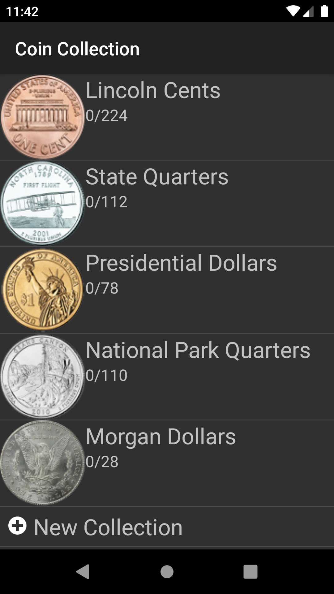
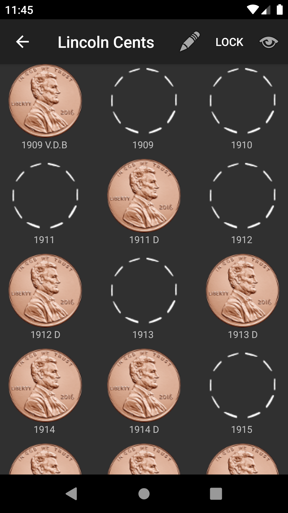
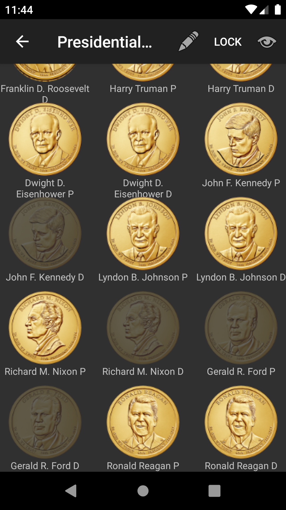
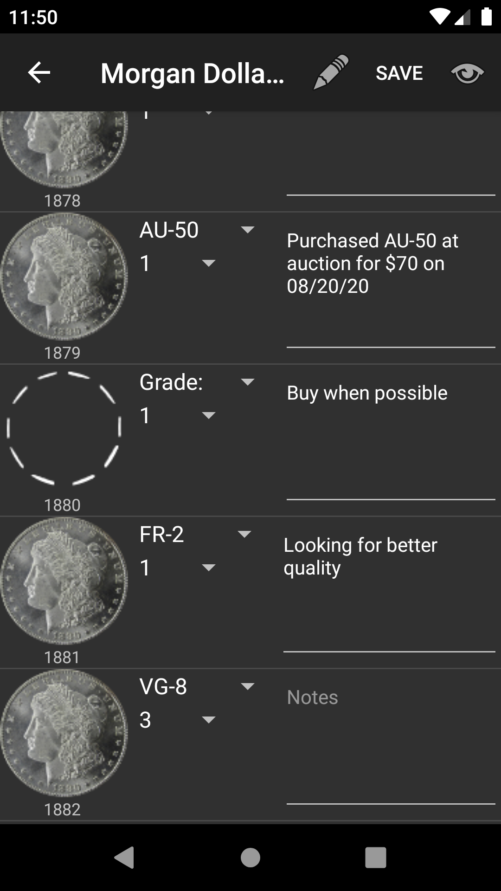

# Coin Collection
Repo for the Coin Collection Android app

Coin Collection helps people keep track of the coins they have or are missing for a variety of U.S. coin sets. Many of the more recent U.S. coin sets are supported (see list below), and the app can be used to track quantities, grades, and notes for each coin. See [Using-the-app](#Using-the-app), [Features](#Features), or [Contributions](#Contributions) for more details!

## Download the app

 

<table>
    <tr>
        <td></td>
        <td></td>
        <td></td>
        <td></td>
    </tr>
</table>

## Using the app
If you need help using the app or aren't sure how to do something, see our [Using the app wiki](https://github.com/anwilli5/coin-collection-android-US/wiki/Using-the-App)

## Currently supported collections
Supported U.S. coin sets include:
- American Eagle Silver Dollars
- American Innovation Dollars
- American Women Quarters
- Barber Dimes
- Barber Half Dollars
- Barber Quarters
- Buffalo Nickels
- Eisenhower Dollars
- First Spouse Gold Coins
- Franklin Half Dollars
- Indian Head Cents
- Jefferson Nickels
- Kennedy Half-Dollars
- Liberty Head Nickels
- Lincoln Cents
- Mercury Dimes
- Morgan Dollars
- National Park Quarters
- Native American/Sacagawea Dollars
- Peace Dollars
- Presidential Dollars
- Roosevelt Dimes
- Standing Liberty Quarters
- State Quarters including D.C. and Territories
- Susan B. Anthony Dollars
- Walking Liberty Half Dollars
- Washington Quarters

## Features
- Create multiple collections of various types
- 'Advanced' view for entering quantities, grades, notes, etc.
- 'Lock' feature to prevent making accidental changes
- Ability to copy/edit/delete coins in a collection
- Automatic and manual ways to backup/restore and share collections

## Contributions
- Pull requests are welcome! For more details see [Contributing](https://github.com/anwilli5/coin-collection-android-US/blob/master/CONTRIBUTING.md)
- Review open issues, feature requests, and add comments here [Open issues](https://github.com/anwilli5/coin-collection-android-US/issues)
- Let us know if you've found an issue or would like to request a feature [Report an issue](https://github.com/anwilli5/coin-collection-android-US/issues/new/choose)

## Development/Building
For information about building the app, unit testing, and other helpful links, refer to the [Development Wiki](https://github.com/anwilli5/coin-collection-android-US/wiki/Development)