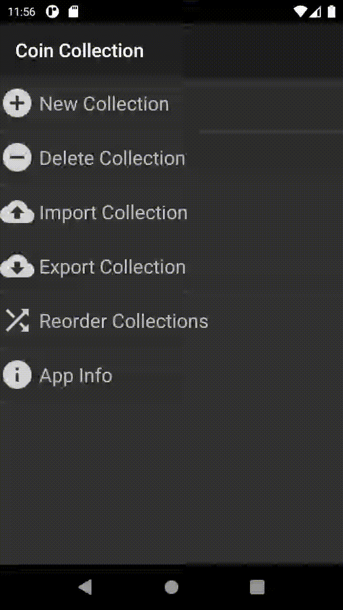
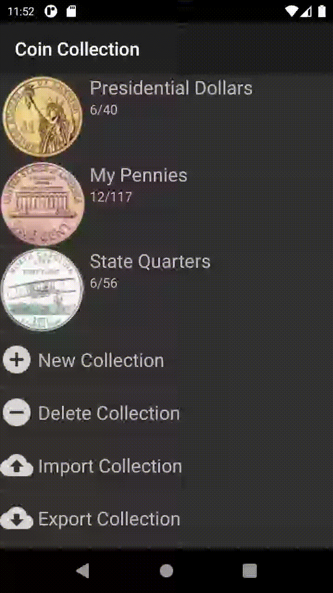
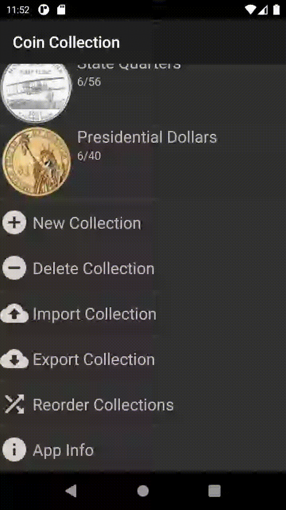

# Coin Collection
<b>Repo for the Coin Collection Android app</b>.

 
Coin Collection helps users interested in collecting a set of coins keep track of which coins they already have. This comes in handy if you are trying to collect the 50 U.S. State Quarters, for example, and want to check whether the quarter you just got back in change from the vending machine should be highly guarded until it can be placed in your collection.  

<b>Download Coin Collection App</b>

 

<table>
    <tr>
        <td></td>
        <td></td>
        <td></td>
        <td></td>
    </tr>
</table>
<table>
    <tr>
        <td></td>
        <td></td>
        <td></td>
        <td></td>
    </tr>
</table>

The current version only supports U.S. currency, specifically:
- American Eagle Silver Dollars
- American Innovation Dollars
- Barber Dimes
- Barber Half Dollars
- Barber Quarters
- Buffalo Nickels
- Eisenhower Dollars
- First Spouse Gold Coins
- Franklin Half Dollars
- Indian Head Cents
- Jefferson Nickels
- Kennedy Half-Dollars
- Liberty Head Nickels
- Lincoln Cents
- Mercury Dimes
- Morgan Dollars
- National Park Quarters
- Native American/Sacagawea Dollars
- Peace Dollars
- Presidential Dollars
- Roosevelt Dimes
- Standing Liberty Quarters
- State Quarters including D.C. and Territories
- Susan B. Anthony Dollars
- Walking Liberty Half Dollars
- Washington Quarters

## Features
- :heavy_plus_sign: Add New Collection

- :heavy_minus_sign: Delete a Collection

- :arrow_up: Import Collection

- :arrow_down: Export Collection

- :twisted_rightwards_arrows: Reorder Collection

## Contributions
All types of contributions are welcome here. If you are a beginner refer to [Contributing.md](https://github.com/anwilli5/coin-collection-android-US/blob/master/Contributing.md) for successfull contribution.

Further , you can browse the [Open issues](https://github.com/anwilli5/coin-collection-android-US/issues) to fix an issue in the app.

If you found a bug or wish to add a new feature you are welcome to [Create a new Issue](https://github.com/anwilli5/coin-collection-android-US/issues/new?assignees=&labels=&template=issue_template.yaml&title=Issue%3A+)

**Please adhere to this project's [Code Of Counduct](https://github.com/anwilli5/coin-collection-android-US/blob/master/CODE_OF_CONDUCT.md)**

## Development/Building
For information about accessing & building the app, unit testing, and other helpful links, refer to
[Development Wiki](https://github.com/anwilli5/coin-collection-android-US/wiki/Development)

## Resources/References
- **[Google Play](https://play.google.com/store/apps/details?id=com.spencerpages)**
- **[Issues](https://github.com/anwilli5/coin-collection-android-US/issues)**
- **[Development Wiki](https://github.com/anwilli5/coin-collection-android-US/wiki/Development)**
- **[Contributing.md](https://github.com/anwilli5/coin-collection-android-US/blob/master/Contributing.md)**
- **[License](https://github.com/anwilli5/coin-collection-android-US/blob/master/LICENSE)**
- **[Notice](https://github.com/anwilli5/coin-collection-android-US/blob/master/NOTICE)**
- **[Code Of Conduct](https://github.com/anwilli5/coin-collection-android-US/blob/master/CODE_OF_CONDUCT.md)**

## Licensing
This Project is licensed under **GNU General Public License v3.0** (Refer to [LICENSE](https://github.com/anwilli5/coin-collection-android-US/blob/master/LICENSE)) and the Material Icons used in this app are under **Google LLC 2020 Copyright** which is Licenced under **Apache License, Version 2.0** (Refere to [NOTICE](https://github.com/anwilli5/coin-collection-android-US/blob/master/NOTICE)).
