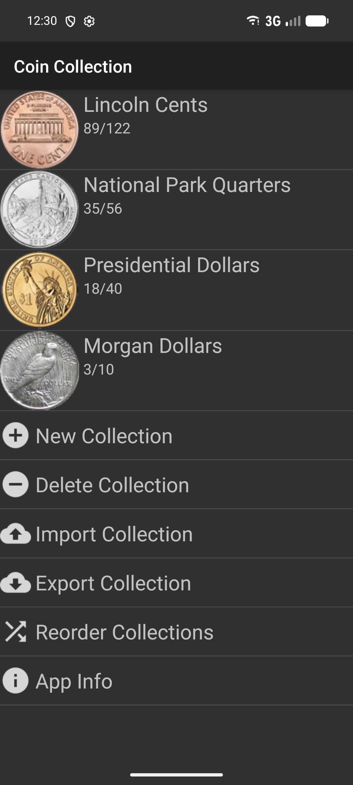
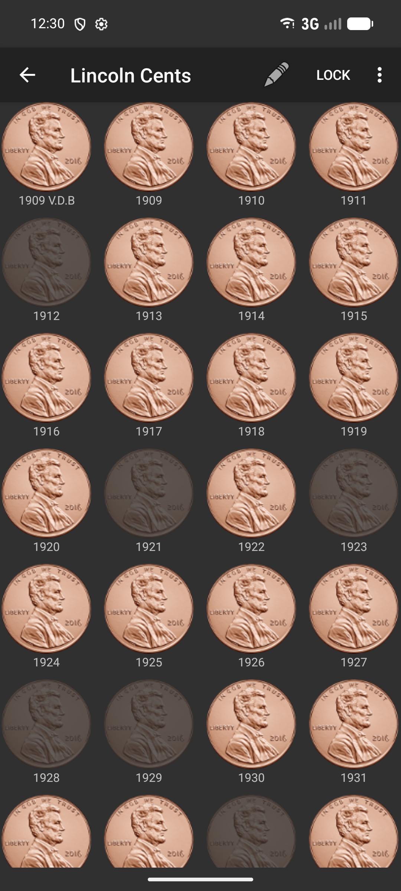
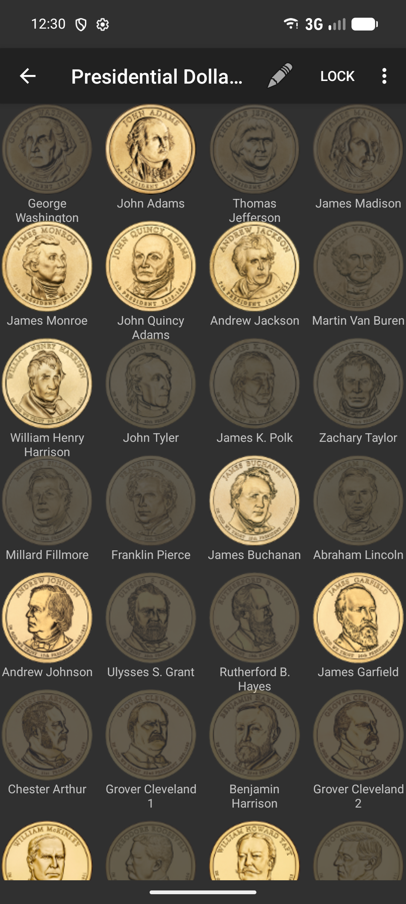
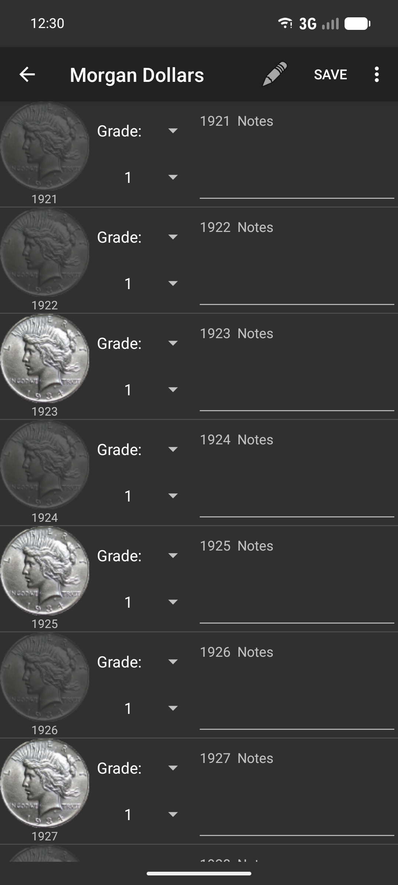

# Coin Collection
Repo for the Coin Collection Android app

Coin Collection helps people keep track of the coins they have or are missing for a variety of U.S. coin sets. Many of the more recent U.S. coin sets are supported (see list below), and the app can be used to track quantities, grades, and notes for each coin. See [Using-the-app](#Using-the-app), [Features](#Features), or [Contributions](#Contributions) for more details!

## Download the app

 

<table>
    <tr>
        <td></td>
        <td></td>
        <td></td>
        <td></td>
    </tr>
</table>

## Using the app
If you need help using the app or aren't sure how to do something, see our [Using the app wiki](https://github.com/anwilli5/coin-collection-android-US/wiki/Using-the-App)

## Currently supported collections
Supported U.S. coin types include:
- All regular issue large and small Cents
- Lincoln Memorial and Shield proof Cents
- All regular issue Nickels
- Jefferson proof Nickles
- All regular issue Halve Dimes
- All regular issue Dimes
- Roosevelt silver and clad proof Dimes
- All regular issue Quarters
- Silver and clad proof Quarters 1964 and later
- All regular issue Halve Dollars
- Silver and clad proof Kennedy Halve Dollars
- Franklin proof Halve Dollars
- All regular issue silver Dollars
- Eisenhower Dollars and clad and silver proofs
- Susan B. Anthony Dollars and proofs
- Native American/Sacagawea Dollars and proofs
- Presidential Dollars and proofs
- American Innovation Dollars and proofs and reverse proofs
- All Halve Cents
- All Two cents
- All Three Cents
- All Twenty Cents
- Sets
- First Spouse Gold Coins

## Features
- Create multiple collections of various types
- 'Advanced' view for entering quantities, grades, notes, etc.
- 'Lock' feature to prevent making accidental changes
- Ability to copy/edit/delete coins in a collection
- Ability to change image of coin in collection
- Automatic and manual ways to backup/restore and share collections
- Ability to add proofs as desired
- Ability to add Satin finish coins as desired
- Ability to add West Point mint coins as desired

## Contributions
- Pull requests are welcome! For more details see [Contributing](https://github.com/anwilli5/coin-collection-android-US/blob/main/CONTRIBUTING.md)
- Review open issues, feature requests, and add comments here [Open issues](https://github.com/anwilli5/coin-collection-android-US/issues)
- Let us know if you've found an issue or would like to request a feature [Report an issue](https://github.com/anwilli5/coin-collection-android-US/issues/new/choose)

## Development/Building
For information about building the app, unit testing, and other helpful links, refer to the [Development Wiki](https://github.com/anwilli5/coin-collection-android-US/wiki/Development)
